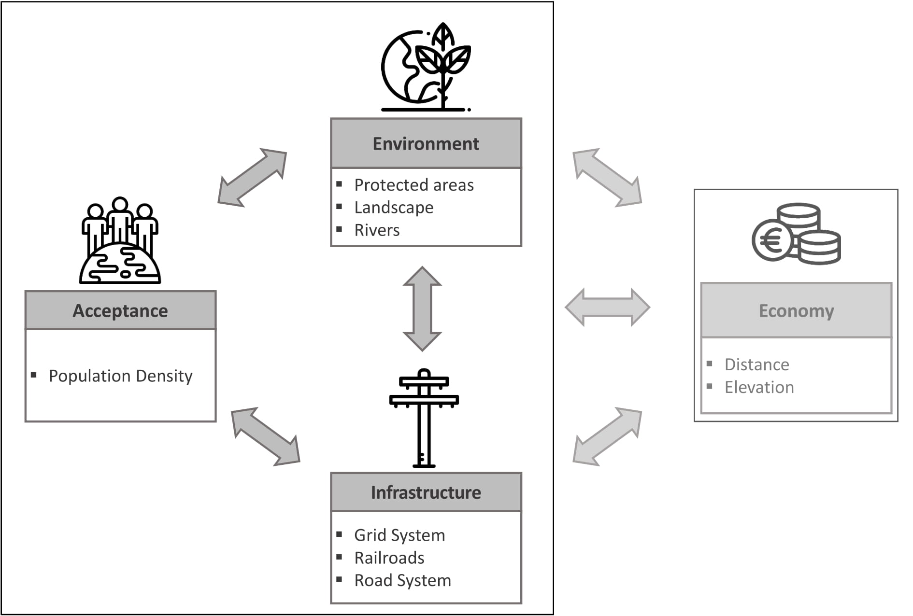

# GIS-EU

## Motivation
Development of electricity infrastructure is needed to for large scale integration of renewables. Several countries like Germany are facing challenges to grid development. Grid development requires extensive public deliberation and several factors need to be considered besides financial cost including environmental impact, public acceptance, current infrastructure etc. A large amount of GIS data required for this analysis exists however is scattered and spread out. Furthmore, to the best of our knowledge, no open-source package provides framework for analysing the cross impact of different factors on grid development. Here we provide a code base for analysing this cross impact. 

The accompanying **paper** detailing the analysis can be found here.

The accompanying **data** can be found here. 
## Installation
It is highly recommended to create a anaconda environment to install the required packages and dependencies. Check out: [Ananconda Install](https://www.anaconda.com/download/) on instructions to install anaconda.
Check out [Anaconda Environment](https://conda.io/docs/user-guide/tasks/manage-environments.html) for creating and working with conda environement. 

Please clone the repository into a local folder. As this repository is under active development, and hence use of git vc is recommended to update the changes. Please feel free to contribute. The required packages are written in environment.yml file. You can change the name of the environment in the environment.yml file: To create the environment navigate to local folder and use:

```
conda create env -f  environment.yml
```

## Data
Data raster datafiles used in this package are not stored in this repository but provided seperately. --- insert information about downloading data ---

The downloaded data should be stored in the subfolder: 01_Data500 (update if changed).

| Parameter     | Processing    | Source    | License |
|-----------    |------------   |--------   |---------|
| Elevation     | Rasterization, Adjust Projection | [European Environment Agency](https://www.eea.europa.eu/data-and-maps/data/eu-dem) | policy based on Directive 2003/98/EC |
| Slope         | Calculate slope, rasterize, adjust projection | [European Environment Agency](https://www.eea.europa.eu/data-and-maps/data/eu-dem) | policy based on Directive 2003/98/EC |
| Land Quality  | Rate fields, rasterize, adjust projection | [European Environment Agency](https://www.eea.europa.eu/data-and-maps/data/eu-dem) | policy based on Directive 2003/98/EC |
| Protected Areas| rasterize, adjust projection, assign values | [ProtectedPlanet2018](https://www.protectedplanet.net/c/world-database-on-protected-areas)  | [WDPA Data Licence](https://www.unep-wcmc.org/policies/wdpa-data-licence#data_policy) |
| River Courses| Extract data, assign values, rasterize |[Geofabrik](https://download.geofabrik.de/)|  [ODbL](https://opendatacommons.org/licenses/odbl/index.html) |
| Population density| Rerasterize |CIESIN; JRC | policy based on Decision 2011/833/EU |
| Railways |  Extract data, rasterize, assign values | [Geofabrik](https://download.geofabrik.de/)| [ODbL](https://opendatacommons.org/licenses/odbl/index.html) |
| Highways |  Extract data, rasterize, assign values | [Geofabrik](https://download.geofabrik.de/)| [ODbL](https://opendatacommons.org/licenses/odbl/index.html)        |
| Electricity Grid | Extract data, rasterize, assign values | [Geofabrik](https://download.geofabrik.de/)| [ODbL](https://opendatacommons.org/licenses/odbl/index.html)        |

## Framework


## Usage

- [01_DataPreparation](https://github.com/samarthiith/PowerLine-GIS/blob/master/01_DataPreparation.ipynb)

	Jupyter notebook for data preparation and visualization. Includes the following:
	- Reading the raster and converting them into array
	- [Jenks Natural breaks](https://en.wikipedia.org/wiki/Jenks_natural_breaks_optimization) of some of the rasters
	- Combining the rasters to form the dimensions according to the Framework
    
- [02_PathCreation](https://github.com/samarthiith/PowerLine-GIS/blob/master/02_PathCreation.ipynb)
	- Jupyter notebook for creating the paths based of different weighted combinations of the dimensions.
	- Sweep over all combination of weights, the path indexes are saved as npy array 

- [03_Analysis](https://github.com/samarthiith/PowerLine-GIS/blob/master/03_Analysis.ipynb)
	- The evaluation criterions:
		- Overlap of path with the actual planned path
		- Length of path
		- Length of path through protected zone
		- Slope classification
	- Evaluations of all the paths created created over the criterions


# License
This repository is published under [MIT License](https://github.com/samarthiith/GIS-EU/blob/master/LICENSE)
